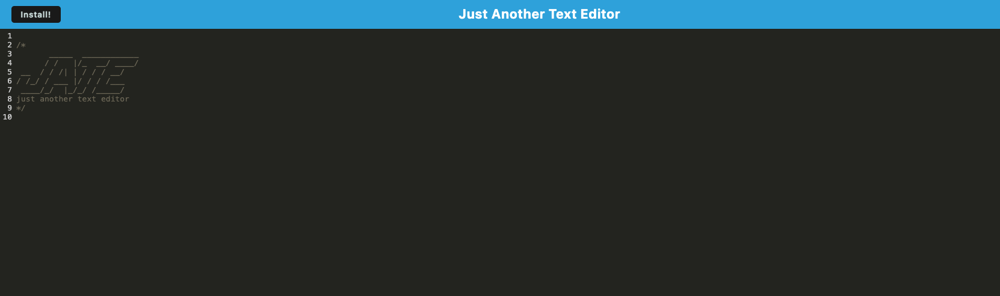
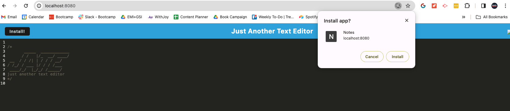

# friendly-disco
A browser-based text editor that works with or without an internet connection

## Description

JATE is a text editor that allows users to write and save notes on their browser.

Importantly, JATE allows you to write and recall your notes whether you are online or not. 

It is the perfect on-the-go note taking application. 

## Table of Contents

- [Installation](#installation)
- [Usage](#usage)
- [Credits](#credits)
- [License](#license)

## Installation

Download the project repository from GitHub: https://github.com/a-r3n/friendly-disco

Then follow the 3 steps:
1. Open and integrated terminal and run 'npm install'
2. Run 'npm run build'
3. Run 'node server/server.js'

## Usage

You can use the application via the Render link: https://friendly-disco-n84l.onrender.com

The below screenshots show how the app should look:

## Credits

This project has been build using starter code: https://github.com/coding-boot-camp/cautious-meme

It also would not be possible without the 3rd party apps and libraries used: Express.js, Webpack and IndexDB. 

Thank you to all those who contributed to the starter code and these 3rd party apps and library. 

## License

This project has been build under an MIT License. 

For more information on the license and conditions of use, please refer to the license document in the GitHub repository: https://github.com/a-r3n/friendly-disco

---
